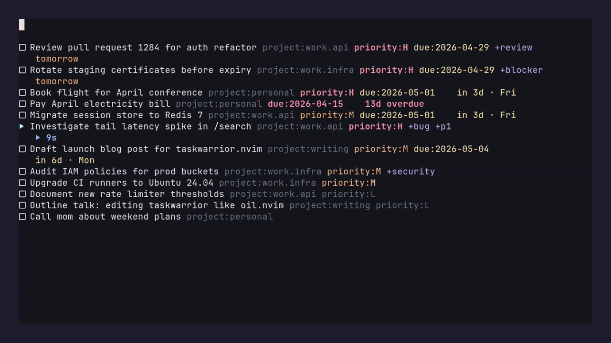
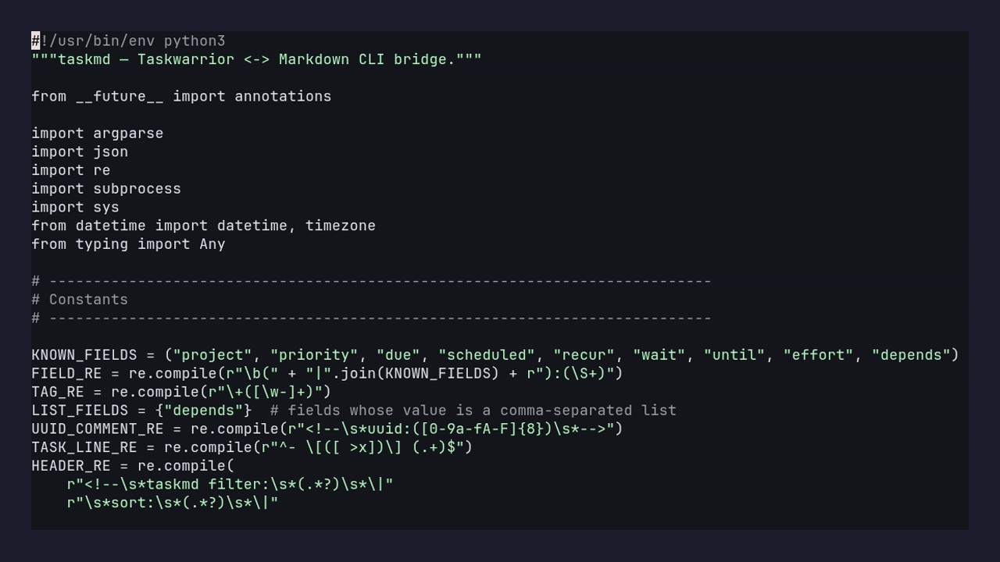
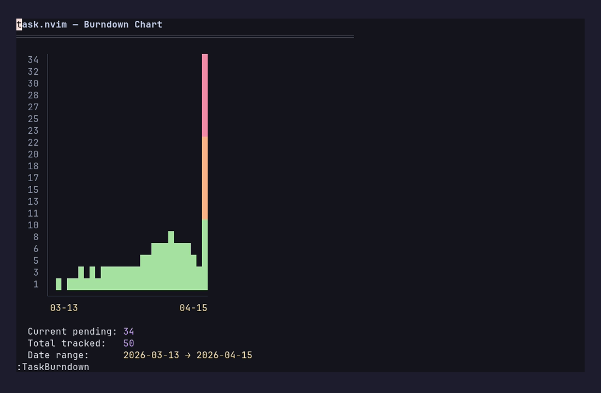
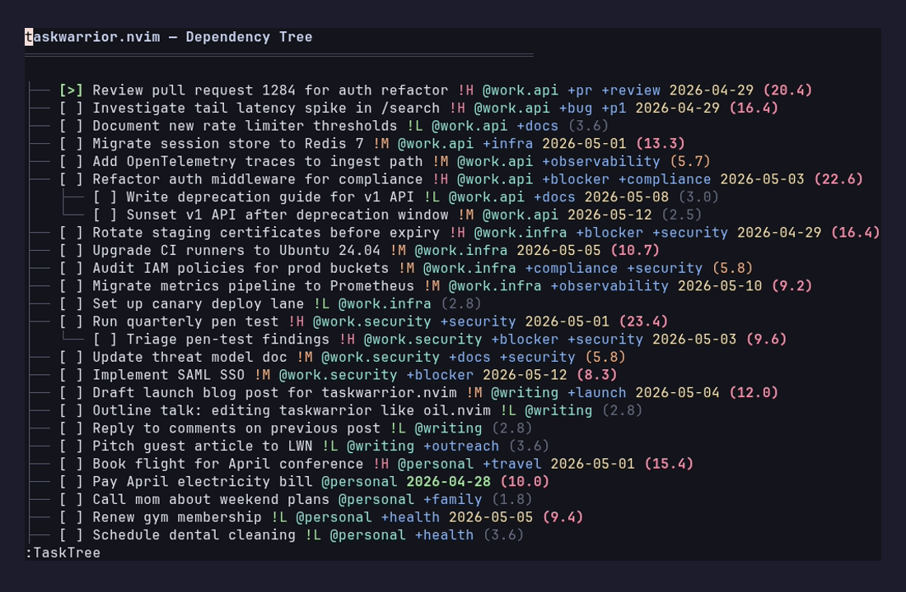
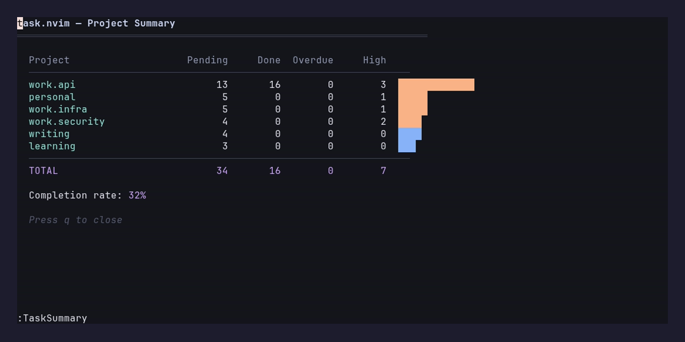
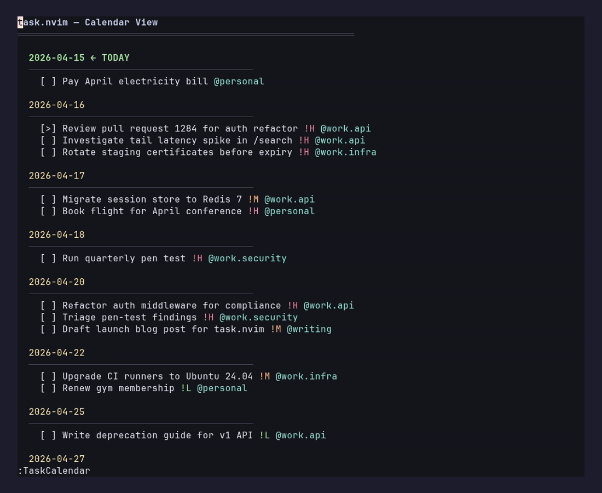
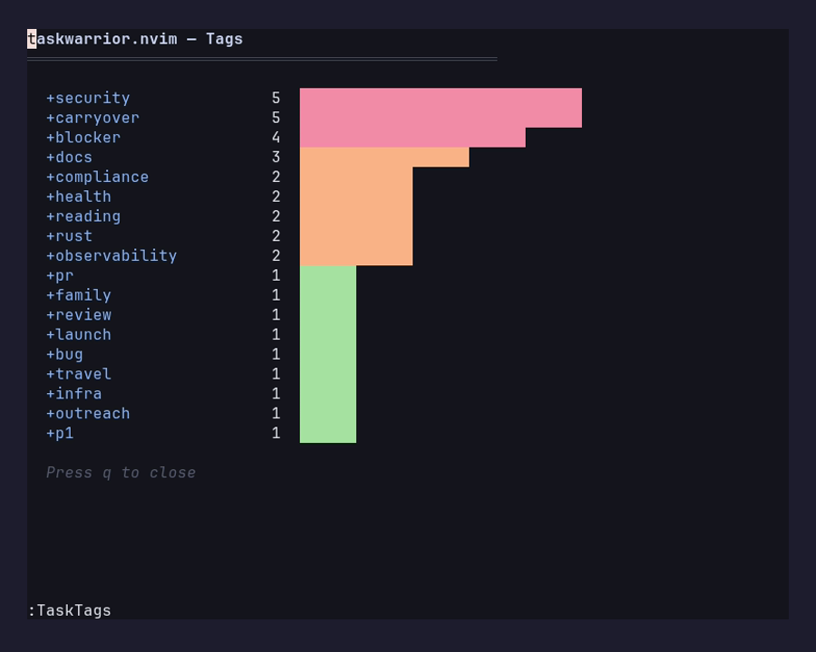
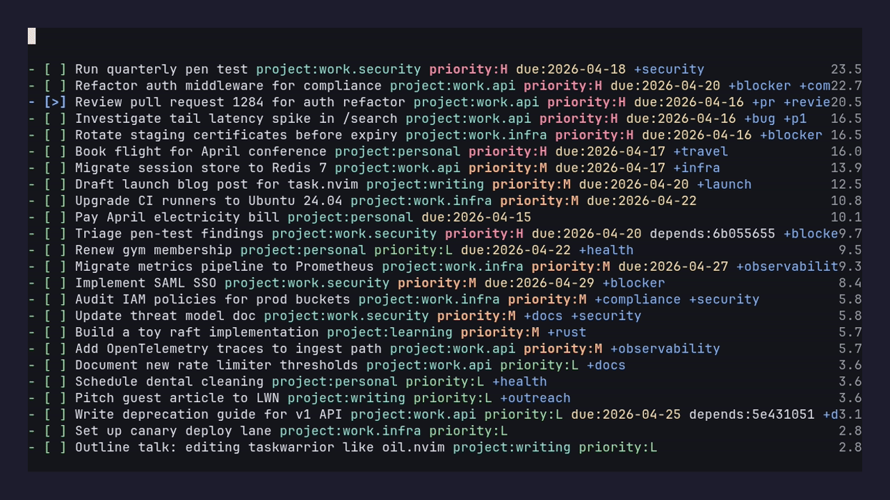
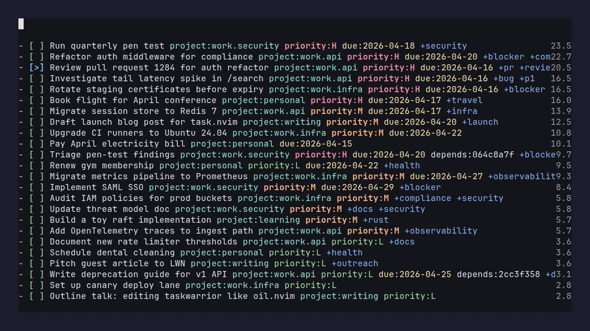
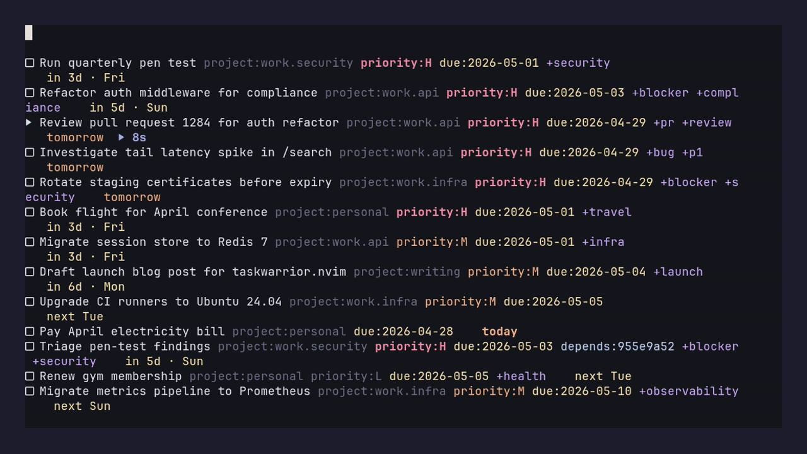

# taskwarrior.nvim

> **Status: Beta.** Usable day-to-day, but APIs and defaults may still change before 1.0. Always keep an external backup of your Taskwarrior data (`cp -r ~/.task ~/.task.bak`); review the confirmation dialog before saving — `:w` issues real `task modify` / `task done` / `task delete` commands. Bug reports and PRs welcome.

> **Migrating from `task.nvim`?** This plugin was renamed in v1.3.0. Update your lazy.nvim spec from `matthandzel/task.nvim` to `matthandzel/taskwarrior.nvim` and replace `require("task")` with `require("taskwarrior")` in your config. The `:Task*` commands and the `taskmd` filetype are unchanged. Saved views, registered projects, and apply backups migrate automatically the first time the plugin loads.

Edit your Taskwarrior tasks as markdown. Every vim motion, macro, and visual-mode operation becomes a task management operation for free. Inspired by [oil.nvim](https://github.com/stevearc/oil.nvim).


```
:Task                                   -- open all pending tasks
V20j:s/project:Inbox/project:career/    -- reassign 20 tasks
dd                                      -- mark task done
o                                       -- add new task inline
:w                                      -- sync all changes at once
```

---

## Browse, filter, group



`:TaskFilter project.startswith:work` narrows to a project. `:TaskGroup project` splits the buffer into `## sections`. `:TaskSort due+` re-sorts within groups. None of this touches your Taskwarrior database — only the view.

## Quick-capture from any buffer



`<leader>ta` pops a floating window in any buffer. Type `Fix auth bug project:work priority:H`, press Enter, go back to what you were doing. The task is in Taskwarrior before your hand leaves the keyboard.

---

## Visualize

Five built-in views read from Taskwarrior — no external charting tools.

### `:TaskBurndown` — completion trend over time



ASCII bar chart of pending-task count by date. Reads `entry` and `end` dates from every task you've ever created, samples to fit the buffer width, color-codes by remaining height (red high → green low). Useful for "am I actually closing tasks faster than I'm opening them?"

### `:TaskTree` — dependency graph



Renders `depends:` relationships as an indented tree. Top-level tasks are roots; `└──` and `├──` connectors show parentage. Urgency score on the right is color-coded (red ≥8, orange ≥4, green below). Dead-simple way to find the leaf tasks that are unblocking everything else.

### `:TaskSummary` — per-project stats



For each project: pending count, done count, overdue count, high-priority count, and a horizontal bar. Bar color is red if any task is overdue, orange if any is high-priority, blue otherwise. Footer shows total completion rate.

### `:TaskCalendar` — by due date



Pending tasks grouped by due date, ordered chronologically. Today is marked `← TODAY`, overdue dates marked `⚠ OVERDUE`. Tasks under each date show priority (`!H`/`!M`/`!L`) and project (`@name`).

### `:TaskTags` — tag frequency



Every tag on every pending task with a count and frequency bar. Quick way to see which tags you're actually using vs. which were one-offs.

---

## Power user

### `:TaskReview` — guided urgency walk



Walks pending tasks in urgency order. For each task: `k` keep, `d` defer, `D` mark done, `m` modify, `g` jump to it in the main buffer, `q` quit. Useful for the "weekly tidy" pass where you want to look at every urgent task and decide what to do with it without opening a separate buffer.

### `:TaskDelegate` — hand a task to Claude



Opens a popup form (extra context, flags, model, system-prompt-file) and runs Claude in a visible bottom split. Visual-range support: `V` to select multiple task lines, then `:TaskDelegate` delegates them all in one Claude session. `:TaskDelegate copy` and `:TaskDelegate copy-command` copy the assembled prompt or the full shell invocation to the `+` register without spawning anything.

### `:TaskDiffPreview` — see edits before you save



Toggle with `:TaskDiffPreview on`. As you edit, virtual-text labels appear at end-of-line: `+ ADD`, `~ MODIFY`, `✓ DONE`, `✗ DELETE`, `▶ START`, `◼ STOP`. 400ms debounce keeps it from running on every keystroke. Same data the `:w` confirmation dialog uses — just shown live.

### `:TaskStart` / `:TaskStop`

Mark the task on the cursor as actively in-progress (`task UUID start`) or pause it (`task UUID stop`). Active tasks show `[>]` in the buffer.

### `:TaskSave` / `:TaskLoad` — saved views

`:TaskSave morning` saves the current filter+sort+group as a named view. `:TaskLoad morning` reopens it. Persisted to `stdpath("data")/taskwarrior.nvim/saved-views.json`. Tab-completes saved names.

### `:TaskUndo`

Reverses the last save's actions. Reads the action log from the buffer's last apply and emits the inverse `task modify` / `task add` / `task start` calls. Best-effort — anything Taskwarrior cannot reverse (e.g. `task delete` on a UUID) is reported as an error.

---

## Auto-project filter from cwd

Register the directories you work in:
```
:TaskProjectAdd career      -- maps cwd to project:career
:TaskProjectList            -- show all mappings
:TaskProjectRemove          -- unmap cwd
```

After that, `:Task` (with no filter) auto-applies `project:<name>` whenever you launch it from inside a registered directory. Persisted to `stdpath("data")/taskwarrior_nvim_projects.json`.

---

## Ecosystem

These are bundled but require their own host plugins to be installed.

| Module | Path | Activate |
|---|---|---|
| Telescope picker | `lua/telescope/_extensions/task.lua` | `require("telescope").load_extension("task")` then `:Telescope task tasks` |
| nvim-cmp source | `lua/taskwarrior/cmp.lua` | `require("cmp").register_source("task", require("taskwarrior.cmp").new())` then add `{ name = "task" }` to your cmp sources |
| Statusline component | `lua/taskwarrior/statusline.lua` | `require("taskwarrior.statusline").render()` — returns a string with the active task / overdue count / next due |

Screenshots for these are coming once a richer demo init that loads telescope/cmp/lualine lands.

---

## Requirements

- Neovim ≥ 0.9
- Taskwarrior ≥ 2.6 (compatible with 3.x)
- Python ≥ 3.8 — only required for the optional `bin/taskmd` CLI and the live diff-preview virtual text. The default in-editor render/save path is pure Lua.

## Installation

```lua
-- lazy.nvim
{
  "matthandzel/taskwarrior.nvim",
  config = function()
    require("taskwarrior").setup()
  end,
}
```

## Quick Start

```
:Task                          -- view all pending tasks
:Task project:career +ais      -- filter tasks
:Task due.before:eow           -- tasks due this week
```

Edit any line. `:w` to sync. That's it.

---

## All commands

| Command | Description |
|---|---|
| `:Task [filter]` | Open task buffer with optional Taskwarrior filter |
| `:TaskFilter [filter]` | Change filter on current buffer |
| `:TaskSort <spec>` | Change sort order (e.g. `due+`, `urgency-`, `priority-`) |
| `:TaskGroup [field]` | Change grouping (`project`, `tag`, or `none`) |
| `:TaskRefresh` | Reload from Taskwarrior |
| `:TaskAdd` | Quick-capture a task (floating window) |
| `:TaskUndo` | Reverse last save's changes |
| `:TaskHelp` | Show all commands, keybindings, syntax |
| `:TaskStart` / `:TaskStop` | Start / stop active timer on task under cursor |
| `:TaskSave <name>` / `:TaskLoad [name]` | Save / restore the current filter+sort+group as a named view |
| `:TaskReview` | Guided urgency walk through pending tasks |
| `:TaskDelegate [copy\|copy-command]` | Delegate task(s) to Claude in a popup form |
| `:TaskDiffPreview [on\|off\|toggle]` | Toggle live virt-text diff preview |
| `:TaskBurndown` | Pending-task burndown chart |
| `:TaskTree` | Dependency tree |
| `:TaskSummary` | Per-project stats |
| `:TaskCalendar` | Tasks grouped by due date |
| `:TaskTags` | Tag-frequency view |
| `:TaskProjectAdd [name]` / `:TaskProjectRemove` / `:TaskProjectList` | Auto-project mapping |

## Keybindings (buffer-local)

| Key | Action |
|---|---|
| `<CR>` | Toggle task complete/pending |
| `o` | New task below |
| `O` | New task above |
| `dd` | Delete task (marks done on save by default) |
| `yy` + `p` | Duplicate task |
| `ga` | Add annotation |
| `gf` | View formatted `task info` |
| `<leader>ta` | Quick-capture (global, works from any buffer) |
| `<leader>tt` | Open task buffer (global) |
| `<leader>tf` | Change filter (in task buffer) |
| `<leader>ts` | Change sort (in task buffer) |
| `<leader>tg` | Change group (in task buffer) |
| `<leader>tpa` | Register cwd as a project |

## Metadata syntax

Tasks use Taskwarrior-native syntax after the description:

```
- [ ] Fix login bug project:Work priority:H due:2026-04-01 +urgent +backend
```

**Fields:** `project:`, `priority:` (H/M/L), `due:`, `scheduled:`, `recur:`, `wait:`, `until:`, `effort:`, `depends:`

**Tags:** `+tagname` (supports hyphens: `+my-tag`)

**UDAs:** Custom fields are auto-discovered from your Taskwarrior config (`task _udas`) and serialized inline. Verified: render, edit, save round-trip on both backends.

## Configuration

```lua
require("taskwarrior").setup({
  on_delete = "done",          -- "done" or "delete" when lines are removed
  confirm = true,              -- show confirmation dialog before applying
  sort = "urgency-",           -- default sort (field+ for asc, field- for desc)
  group = nil,                 -- default group field (nil to disable)
  fields = nil,                -- fields to show (nil = all)
  capture_key = "<leader>ta",  -- global quick-capture (nil to disable)
  open_key = "<leader>tt",     -- global open-task-buffer (nil to disable)
  filter_key = "<leader>tf",   -- buffer-local filter (nil to disable)
  sort_key = "<leader>ts",     -- buffer-local sort
  group_key = "<leader>tg",    -- buffer-local group
  project_add_key = "<leader>tpa",  -- register cwd as a project
  filters = {},                -- named filter presets (see :h)
  projects = {},               -- directory-to-project mapping
  icons = true,                -- nerd font checkbox/header icons
  border_style = "rounded",    -- "rounded" | "single" | "double" | "none"
  capture_width = nil,         -- quick-capture width (nil = auto)
  capture_height = 3,          -- quick-capture height in lines
  auto_backup = true,          -- copy ~/.task to stdpath("data")/taskwarrior.nvim/backups/ before apply
  auto_backup_keep = 10,       -- number of recent backups to retain
  delegate = {
    command = "claude",
    flags = "",                -- e.g. "--dangerously-skip-permissions" (opt-in)
    model = nil,
    system_prompt_file = nil,
    height = 0.5,
  },
})
```

### Custom urgency with UDAs

If you have custom UDA fields (e.g. `utility`, `effort`) and want them to affect task sort order, use `urgency_coefficients`. For each field, the urgency adjustment is **value x coefficient** — proportional to the actual numeric value, not just whether the field is present:

```lua
require("taskwarrior").setup({
  urgency_coefficients = {
    utility = 1.0,     -- utility:8 adds +8, utility:20 adds +20
    effort = -0.5,     -- effort:60 subtracts -30 (do easy wins first)
  },
})
```

The default is `{}` (no adjustments) — set only the fields you use.

For non-linear urgency (e.g. `log(utility)` or `utility / effort`), use `custom_urgency` — a Lua function that receives the full task table and returns a number:

```lua
require("taskwarrior").setup({
  custom_urgency = function(task)
    local base = task.urgency or 0
    local utility = tonumber(task.utility) or 0
    local effort = tonumber(task.effort) or 60
    return base + math.log(utility + 1) * 3 - math.sqrt(effort) * 0.1
  end,
})
```

## How it works

1. `:Task` runs the Lua backend (`lua/taskwarrior/taskmd.lua`) which calls `task export`, parses the JSON, and renders markdown checkboxes with concealed `<!-- uuid:ab05fb51 -->` markers
2. You edit the buffer with standard vim operations
3. On `:w`, the plugin diffs your edits against fresh Taskwarrior state
4. A confirmation dialog shows what will change (`:TaskDiffPreview on` shows it live as you type)
5. Changes are applied via `task modify` / `task done` / `task add` / `task delete`
6. The buffer re-renders from Taskwarrior truth

UUID markers are invisible thanks to `conceallevel=3` + `concealcursor`, and survive any vim operation that preserves the line.

## Health check

Run `:checkhealth taskwarrior` to verify your setup (Neovim version, Taskwarrior CLI, optional Python, `taskmd` binary, data directory).

## CLI usage

The bundled `taskmd` CLI is optional and works standalone for scripting and automation:

```bash
taskmd render project:Inbox --sort=due+      # markdown to stdout
taskmd render --group=project                # grouped view
taskmd apply tasks.md                         # sync edits back
taskmd apply tasks.md --dry-run              # preview changes as JSON
taskmd completions                            # JSON for editor completion
```

Useful for: piping rendered tasks through `grep`/`fzf`, automating bulk operations from shell scripts, integrating with non-vim editors.

## Data safety

`:w` issues real `task modify` / `task done` / `task add` / `task delete`
commands against your Taskwarrior database. There is no staging.

By default (`auto_backup = true`), the plugin copies your Taskwarrior data
directory to `stdpath("data")/taskwarrior.nvim/backups/<timestamp>/` immediately
before any apply. The ten newest backups are kept; older ones are pruned.
Disable with `auto_backup = false` in `setup()`.

The CLI also refuses to `apply` a file with a missing or malformed header
unless you pass `--force`, preventing the "hand-wrote a file, got every
pending task marked done" failure mode.

**You should still keep an external backup of `~/.task`.** The plugin's
backups are a convenience, not a replacement.

## Help

Run `:help taskwarrior.nvim` inside Neovim for the full reference, or read
[`doc/taskwarrior.txt`](doc/taskwarrior.txt). `:checkhealth taskwarrior`
verifies your setup.

## Contributing

See [CONTRIBUTING.md](CONTRIBUTING.md). Quick version:

```bash
python3 -m pytest tests/ -v        # 358 tests, stdlib-only CLI
```

Every bug fix needs a regression test. The Python test suite covers the
`bin/taskmd` CLI and the Lua backend's parser/serializer/diff contract is
tested via the CLI-compatibility boundary.

## Changelog

See [CHANGELOG.md](CHANGELOG.md).

## License

MIT
